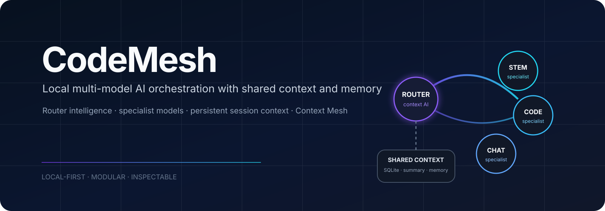
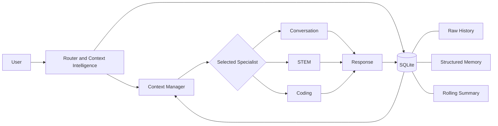

<p align="center">
  
</p>

<p align="center">
  <strong>A local-first multi-model AI assistant that routes prompts to specialized Ollama models while preserving shared context and inspectable memory.</strong>
</p>

<p align="center">
  <a href="LICENSE"></a>
  
  
  
  <a href="https://github.com/brinesolution/CodeMesh/actions/workflows/ci.yml"></a>
</p>

<p align="center">
  <a href="docs/ARCHITECTURE.md">Architecture</a> ·
  <a href="docs/TEST_MATRIX.md">Testing</a> ·
  <a href="docs/DEMO.md">Demo</a> ·
  <a href="LICENSE">License</a>
</p>

---

## Overview

CodeMesh runs multiple local language models behind one chat interface. A lightweight Router classifies each request, manages shared session context, and selects a focused Conversation, STEM, or Coding specialist. SQLite persists the raw conversation, structured memory, rolling summaries, and context metadata so specialists can switch without losing continuity.

The project is designed for local operation first: Ollama provides inference, FastAPI coordinates routing and context, and a React interface exposes chat, telemetry, model configuration, and the Context Mesh visualizer.

## Core capabilities

| Capability | What it provides |
|---|---|
| Multi-model routing | Auto mode selects Conversation, Math & Science, or Coding specialists; manual modes remain available. |
| Runtime model assignment | Any locally installed Ollama model can be assigned to Router, Conversation, STEM, or Coding without restarting CodeMesh. |
| Shared context intelligence | Recent messages, rolling summaries, structured memory, goals, decisions, and constraints are assembled into bounded specialist context. |
| Persistent local sessions | SQLite stores chats and context locally and reconstructs state after restart. |
| Context Mesh | Interactive Graph, Context, Timeline, and Storage views show how a selected chat is remembered and assembled. |
| Streaming and telemetry | Responses stream to the UI while system health, model state, CPU, RAM, and GPU data remain inspectable. |
| Local-first privacy | No paid model API is required; chat databases, local environments, logs, and model files are excluded from Git. |

## Architecture



The Router provides routing and context intelligence; the Context Manager enforces deterministic limits and builds the specialist package; SQLite remains the durable source of truth. Specialist models generate the final answer.

## Default models

| Role | Default Ollama model |
|---|---|
| Router | `qwen3:0.6b` |
| Conversation | `smollm2:1.7b` |
| Math & Science | `qwen3:1.7b` |
| Coding | `qwen2.5-coder:3b` |

These are defaults, not hardcoded requirements. The Models panel discovers the local Ollama catalog and lets each role be reassigned at runtime.

## Stack

| Layer | Technology |
|---|---|
| Frontend | React 19, TypeScript, Vite, Tailwind CSS, XYFlow/React Flow |
| Backend | Python 3.12+, FastAPI, Pydantic, SQLAlchemy |
| Inference | Ollama |
| Persistence | SQLite |
| Validation and testing | Pytest, Ruff, MyPy, Vitest, TypeScript |

## Requirements

CodeMesh is Windows-first for the current local release. Install:

- Python 3.12 or 3.13
- Node.js and npm
- `uv`
- Ollama

16 GB RAM is recommended for the default model set. An NVIDIA GPU with about 8 GB VRAM improves latency, but the architecture does not require that exact GPU and can run more slowly on CPU-capable systems.

## Quick start

```powershell
git clone https://github.com/brinesolution/CodeMesh.git
Set-Location CodeMesh
.\scripts\bootstrap.ps1
.\scripts\doctor.ps1
.\scripts\pull-models.ps1
.\scripts\dev.ps1
```

Open `http://127.0.0.1:5173`.

Stop only the processes launched by CodeMesh with:

```powershell
.\scripts\stop.ps1
```

The application creates `backend/data/codemesh.db` on first start. Copy `.env.example` to `.env` only when local overrides are needed.

## Default model setup

```powershell
ollama pull qwen3:0.6b
ollama pull smollm2:1.7b
ollama pull qwen3:1.7b
ollama pull qwen2.5-coder:3b
```

The supplied model setup script performs the same checks and avoids unnecessary re-pulls:

```powershell
.\scripts\pull-models.ps1
```

## Context Mesh

Context Mesh is the visual debugger for CodeMesh session intelligence. For the selected chat it exposes four read-only views:

- **Graph** — relationships between the session, Router, memories, summary, recent messages, context package, specialists, and SQLite.
- **Context** — the latest bounded package assembled for the specialist.
- **Timeline** — how messages, memory updates, decisions, goals, and summaries evolved.
- **Storage** — a safe view of the current session's SQLite-backed records and relationships.

It displays application-visible context and operational metadata only; it does not expose hidden model reasoning.

## Testing

Run the standard local checks from the repository root:

```powershell
.\scripts\test.ps1
```

Live Ollama tests are intentionally separate from the fast suite:

```powershell
Set-Location backend
uv run pytest -m live -q
```

See [`docs/TEST_MATRIX.md`](docs/TEST_MATRIX.md) for test coverage and [`docs/DEMO.md`](docs/DEMO.md) for demonstration prompts.

## Project layout

```text
CodeMesh/
├── backend/       FastAPI, routing, context, persistence, tests
├── frontend/      React and TypeScript chat application
├── evaluation/    Routing, latency, and context evaluations
├── scripts/       Bootstrap, diagnostics, models, launch, tests
├── docs/          Architecture, demo, security, status, test evidence
├── .env.example
├── .gitignore
└── README.md
```

## Privacy and local operation

Model requests and chat data remain local by default. Real SQLite databases, `.env` files, virtual environments, `node_modules`, logs, generated reports, and Ollama model artifacts are excluded from the repository. The current local release does not require authentication, billing, cloud infrastructure, or an external model API.

## Documentation

- [`docs/ARCHITECTURE.md`](docs/ARCHITECTURE.md) — architecture and context flow
- [`docs/TEST_MATRIX.md`](docs/TEST_MATRIX.md) — verification matrix
- [`docs/SECURITY_REVIEW.md`](docs/SECURITY_REVIEW.md) — public security review notes
- [`docs/DEMO.md`](docs/DEMO.md) — demonstration prompts
- [`docs/AWS_FUTURE.md`](docs/AWS_FUTURE.md) — future deployment mapping

## Authors

CodeMesh is a student project by Mayank Lohani, Om Jha, and Nihar Bendke.

## License

Released under the [MIT License](LICENSE).
